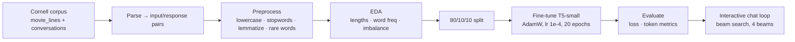

<div align="center">

# 🎬 Context-Aware Movie Chatbot

**A generative dialogue chatbot built by fine-tuning T5 on 220K+ movie-dialogue exchanges from the Cornell Movie-Dialogs Corpus.**


</div>

## Overview
Rule-based chatbots break as soon as a conversation leaves the script. This project builds a **generative** dialogue model instead. It fine-tunes **T5-small** as a text-to-text model (`dialogue: <input>` → `<response>`) on movie conversations, and the inference function `generate_response()` takes a conversation-history list, so earlier turns can be fed back in as context. The pipeline covers corpus parsing, NLP preprocessing, EDA, PyTorch training, evaluation, and an interactive chat loop.

## Key results
These numbers come from `Final_Project_Notebook_Team_6.ipynb`. The model was trained for 20 epochs on 177,025 dialogue pairs and evaluated on 22,128 validation pairs.

| Metric | Value |
|---|:-:|
| Training loss (epoch 1 → 20) | 0.9105 → 0.7360 |
| Validation loss | 1.0251 |
| Token-level accuracy* | 0.870 |
| Token-level weighted F1* | 0.849 |

\* Computed by comparing teacher-forced next-token predictions with target tokens. This measures how well the model fits the dialogue distribution, not the quality of free-form replies.

**Honest read:** generated replies are short and generic (for example, *"oh yeah"*, *"dont know"*). That is typical for a small seq2seq model trained on heavily preprocessed movie lines. In `Chatbot_T5_Evaluation Metrics.ipynb`, a 3-epoch run scored 0.0 exact match against reference replies. The demo loop also passes only the latest user turn into `generate_response()`. Better next steps would be passing the full history, larger checkpoints, lighter text cleaning, and sampling-based decoding.

<p align="center"> </p>

## Approach


## Dataset
[Cornell Movie-Dialogs Corpus (Kaggle mirror)](https://www.kaggle.com/datasets/rajathmc/cornell-moviedialog-corpus), originally by Danescu-Niculescu-Mizil & Lee (2011). It has 220,579 conversational exchanges between 10,292 character pairs, taken from 617 movies (304,713 utterances). A copy of the corpus is included in `data/`.

## Tech stack
Python · PyTorch · Hugging Face Transformers (T5) · NLTK · scikit-learn · pandas · Matplotlib/Seaborn · WordCloud · Jupyter / Google Colab

## Repository structure
```
nlp-context-aware-chatbot/
├── Final_Project_Notebook_Team_6.ipynb   # main end-to-end notebook
├── Chatbot_Clean_Data.ipynb              # parsing and cleaning
├── Chatbot_Preprocess_Split*.ipynb       # preprocessing / split iterations
├── Chatbot_T5_Model.ipynb                # T5 training experiments
├── Chatbot_T5_Evaluation Metrics.ipynb   # generation-level evaluation
├── Chatbot_Metrics.ipynb / Chatbot Metrics.pdf
├── Final Project Deliveries/             # report, notebook PDF, slide deck
├── data/                                 # corpus files + EDA figures
├── models/                               # T5 chatbot helper class (model.py)
├── requirements.txt
└── LICENSE
```

## How to run
```bash
git clone https://github.com/oxayavongsa/nlp-context-aware-chatbot.git
cd nlp-context-aware-chatbot
python3 -m venv chatbot-env && source chatbot-env/bin/activate
pip install -r requirements.txt
cd data && unzip cornell-movie-dialog-corpus.zip && cd ..
jupyter notebook Final_Project_Notebook_Team_6.ipynb
```
Point `lines_file` and `conversations_file` in the notebook at the extracted `data/` files, or use the Kaggle download cell with **your own** Kaggle credentials. Training takes about 11.5 minutes per epoch on a single GPU. Fine-tuned weights are not committed, so the notebook trains and saves them to `models/t5_chatbot_final/`.

## Team & credits
AAI-520 Natural Language Processing, University of San Diego. Instructor: Professor Kahila Mokhtari, Ph.D.
**Outhai Xayavongsa** (Team Lead) · [Saad Saeed](https://github.com/SaadaSaeed86) (Lead Assistant) · [Anand Fernandes](https://github.com/af0808)

---
<sub>Maintained by **Outhai (Thai) Xayavongsa** (MS Applied AI, University of San Diego · MBA) · [GitHub](https://github.com/oxayavongsa) · [Portfolio](https://oxayavongsa.github.io/ai-automation-portfolio/)</sub>
